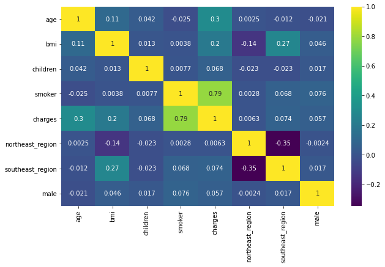
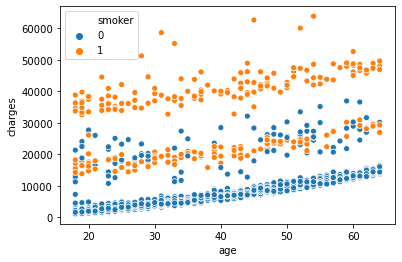
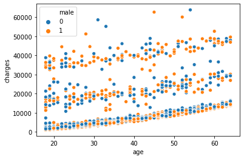
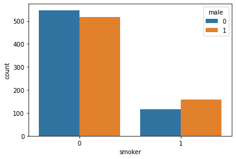
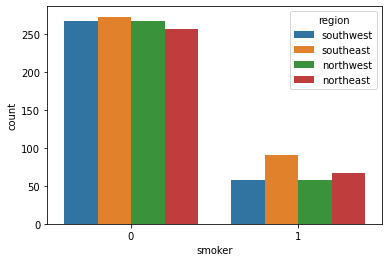
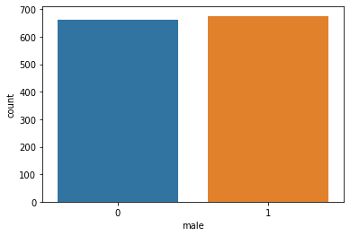
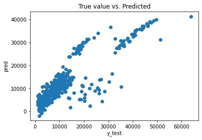

```python
import pandas as pd
import numpy as np
import matplotlib.pyplot as plt
import seaborn as sns
%matplotlib inline
```

# loading the data


```python
med_insurance_df = pd.read_csv("insurance.csv")
```


```python
med_insurance_df.head(2)
```


<div>
<style scoped>
    .dataframe tbody tr th:only-of-type {
        vertical-align: middle;
    }

    .dataframe tbody tr th {
        vertical-align: top;
    }

    .dataframe thead th {
        text-align: right;
    }
</style>
<table border="1" class="dataframe">
  <thead>
    <tr style="text-align: right;">
      <th></th>
      <th>age</th>
      <th>sex</th>
      <th>bmi</th>
      <th>children</th>
      <th>smoker</th>
      <th>region</th>
      <th>charges</th>
    </tr>
  </thead>
  <tbody>
    <tr>
      <th>0</th>
      <td>19</td>
      <td>female</td>
      <td>27.90</td>
      <td>0</td>
      <td>yes</td>
      <td>southwest</td>
      <td>16884.9240</td>
    </tr>
    <tr>
      <th>1</th>
      <td>18</td>
      <td>male</td>
      <td>33.77</td>
      <td>1</td>
      <td>no</td>
      <td>southeast</td>
      <td>1725.5523</td>
    </tr>
  </tbody>
</table>
</div>


```python
med_insurance_df.info()
```

    <class 'pandas.core.frame.DataFrame'>
    RangeIndex: 1338 entries, 0 to 1337
    Data columns (total 7 columns):
     #   Column    Non-Null Count  Dtype  
    ---  ------    --------------  -----  
     0   age       1338 non-null   int64  
     1   sex       1338 non-null   object 
     2   bmi       1338 non-null   float64
     3   children  1338 non-null   int64  
     4   smoker    1338 non-null   object 
     5   region    1338 non-null   object 
     6   charges   1338 non-null   float64
    dtypes: float64(2), int64(2), object(3)
    memory usage: 73.3+ KB
    

# Exploration of data


```python
med_insurance_df['region'].unique()
```


    array(['southwest', 'southeast', 'northwest', 'northeast'], dtype=object)


```python
med_insurance_df.groupby('region').max()['charges']
```


    region
    northeast    58571.07448
    northwest    60021.39897
    southeast    63770.42801
    southwest    52590.82939
    Name: charges, dtype: float64


```python
med_insurance_df.groupby('region').mean()['charges']
```


    region
    northeast    13406.384516
    northwest    12417.575374
    southeast    14735.411438
    southwest    12346.937377
    Name: charges, dtype: float64


```python
pd.get_dummies(med_insurance_df['region'])
```


<div>
<style scoped>
    .dataframe tbody tr th:only-of-type {
        vertical-align: middle;
    }

    .dataframe tbody tr th {
        vertical-align: top;
    }

    .dataframe thead th {
        text-align: right;
    }
</style>
<table border="1" class="dataframe">
  <thead>
    <tr style="text-align: right;">
      <th></th>
      <th>northeast</th>
      <th>northwest</th>
      <th>southeast</th>
      <th>southwest</th>
    </tr>
  </thead>
  <tbody>
    <tr>
      <th>0</th>
      <td>0</td>
      <td>0</td>
      <td>0</td>
      <td>1</td>
    </tr>
    <tr>
      <th>1</th>
      <td>0</td>
      <td>0</td>
      <td>1</td>
      <td>0</td>
    </tr>
    <tr>
      <th>2</th>
      <td>0</td>
      <td>0</td>
      <td>1</td>
      <td>0</td>
    </tr>
    <tr>
      <th>3</th>
      <td>0</td>
      <td>1</td>
      <td>0</td>
      <td>0</td>
    </tr>
    <tr>
      <th>4</th>
      <td>0</td>
      <td>1</td>
      <td>0</td>
      <td>0</td>
    </tr>
    <tr>
      <th>...</th>
      <td>...</td>
      <td>...</td>
      <td>...</td>
      <td>...</td>
    </tr>
    <tr>
      <th>1333</th>
      <td>0</td>
      <td>1</td>
      <td>0</td>
      <td>0</td>
    </tr>
    <tr>
      <th>1334</th>
      <td>1</td>
      <td>0</td>
      <td>0</td>
      <td>0</td>
    </tr>
    <tr>
      <th>1335</th>
      <td>0</td>
      <td>0</td>
      <td>1</td>
      <td>0</td>
    </tr>
    <tr>
      <th>1336</th>
      <td>0</td>
      <td>0</td>
      <td>0</td>
      <td>1</td>
    </tr>
    <tr>
      <th>1337</th>
      <td>0</td>
      <td>1</td>
      <td>0</td>
      <td>0</td>
    </tr>
  </tbody>
</table>
<p>1338 rows × 4 columns</p>
</div>


```python
med_insurance_df['northeast_region'] = pd.get_dummies(med_insurance_df['region'])['northeast']
med_insurance_df['southeast_region'] = pd.get_dummies(med_insurance_df['region'])['southeast']
med_insurance_df['male'] = pd.get_dummies(med_insurance_df['sex'])['male']
med_insurance_df['smoker'] = pd.get_dummies(med_insurance_df['smoker'])['yes']
med_insurance_df.head(2)
```


<div>
<style scoped>
    .dataframe tbody tr th:only-of-type {
        vertical-align: middle;
    }

    .dataframe tbody tr th {
        vertical-align: top;
    }

    .dataframe thead th {
        text-align: right;
    }
</style>
<table border="1" class="dataframe">
  <thead>
    <tr style="text-align: right;">
      <th></th>
      <th>age</th>
      <th>sex</th>
      <th>bmi</th>
      <th>children</th>
      <th>smoker</th>
      <th>region</th>
      <th>charges</th>
      <th>northeast_region</th>
      <th>southeast_region</th>
      <th>male</th>
    </tr>
  </thead>
  <tbody>
    <tr>
      <th>0</th>
      <td>19</td>
      <td>female</td>
      <td>27.90</td>
      <td>0</td>
      <td>1</td>
      <td>southwest</td>
      <td>16884.9240</td>
      <td>0</td>
      <td>0</td>
      <td>0</td>
    </tr>
    <tr>
      <th>1</th>
      <td>18</td>
      <td>male</td>
      <td>33.77</td>
      <td>1</td>
      <td>0</td>
      <td>southeast</td>
      <td>1725.5523</td>
      <td>0</td>
      <td>1</td>
      <td>1</td>
    </tr>
  </tbody>
</table>
</div>


```python
print("Maximun ",med_insurance_df.groupby('male').max()['bmi'])
print("Mean ",med_insurance_df.groupby('male').mean()['bmi'])
```

    Maximun  male
    0    48.07
    1    53.13
    Name: bmi, dtype: float64
    Mean  male
    0    30.377749
    1    30.943129
    Name: bmi, dtype: float64
    


```python
print("Maximun ",med_insurance_df.groupby('smoker').max()['bmi'])
print("Mean ",med_insurance_df.groupby('smoker').mean()['bmi'])
```

    Maximun  smoker
    0    53.13
    1    52.58
    Name: bmi, dtype: float64
    Mean  smoker
    0    30.651795
    1    30.708449
    Name: bmi, dtype: float64
    


```python
print("Maximun ",med_insurance_df.groupby('male').max()['charges'])
print("Mean ",med_insurance_df.groupby('male').mean()['charges'])
```

    Maximun  male
    0    63770.42801
    1    62592.87309
    Name: charges, dtype: float64
    Mean  male
    0    12569.578844
    1    13956.751178
    Name: charges, dtype: float64
    


```python
print("Maximun ",med_insurance_df.groupby('smoker').max()['charges'])
print("Mean ",med_insurance_df.groupby('smoker').mean()['charges'])
```

    Maximun  smoker
    0    36910.60803
    1    63770.42801
    Name: charges, dtype: float64
    Mean  smoker
    0     8434.268298
    1    32050.231832
    Name: charges, dtype: float64
    

# Visualizing data


```python
plt.figure(figsize=(10,6))
sns.heatmap(med_insurance_df.corr(), annot=True, cmap='viridis')
```


    <matplotlib.axes._subplots.AxesSubplot at 0x2cdd12ced30>





```python
sns.scatterplot(x='age', y='charges', data=med_insurance_df, hue='smoker')
```


    <matplotlib.axes._subplots.AxesSubplot at 0x2cdd1d54580>





```python
sns.scatterplot(x='age', y='charges', data=med_insurance_df, hue='male')
```


    <matplotlib.axes._subplots.AxesSubplot at 0x2cdd1ddb400>





```python
sns.countplot(x='smoker', data=med_insurance_df, hue='male')
```


    <matplotlib.axes._subplots.AxesSubplot at 0x2cdd1dd5a00>





```python
sns.countplot(x='smoker', data=med_insurance_df, hue='region')
```


    <matplotlib.axes._subplots.AxesSubplot at 0x2cdd1e5bca0>





```python
sns.countplot(x='male', data=med_insurance_df)
```


    <matplotlib.axes._subplots.AxesSubplot at 0x2cdd2114c70>





# Drop unnecessary data


```python
med_insurance_df.columns
```


    Index(['age', 'sex', 'bmi', 'children', 'smoker', 'region', 'charges',
           'northeast_region', 'southeast_region', 'male'],
          dtype='object')


```python
for col in ['sex', 'children', 'region', 'male']:
  if col in med_insurance_df.columns:
    med_insurance_df.drop(col, axis=1, inplace=True)
```

# Splitting the data for training and testing.


```python
X = med_insurance_df.drop('charges', axis=1)
y = med_insurance_df['charges']

from sklearn.model_selection import train_test_split
X_train, X_test, y_train, y_test = train_test_split(X, y, test_size=0.3, random_state=101)
```

# Linear regression


```python
from sklearn.linear_model import LinearRegression
lm = LinearRegression()
lm.fit(X_train, y_train)

pred = lm.predict(X_test)
```

# Model evaluation


```python
print(lm.intercept_)
```

    -12253.770381676759
    


```python
df = pd.DataFrame(lm.coef_, index=X.columns, columns=['Coefficient'])
df
```


<div>
<style scoped>
    .dataframe tbody tr th:only-of-type {
        vertical-align: middle;
    }

    .dataframe tbody tr th {
        vertical-align: top;
    }

    .dataframe thead th {
        text-align: right;
    }
</style>
<table border="1" class="dataframe">
  <thead>
    <tr style="text-align: right;">
      <th></th>
      <th>Coefficient</th>
    </tr>
  </thead>
  <tbody>
    <tr>
      <th>age</th>
      <td>242.624353</td>
    </tr>
    <tr>
      <th>bmi</th>
      <td>363.750013</td>
    </tr>
    <tr>
      <th>smoker</th>
      <td>23483.797516</td>
    </tr>
    <tr>
      <th>northeast_region</th>
      <td>281.220119</td>
    </tr>
    <tr>
      <th>southeast_region</th>
      <td>-290.320331</td>
    </tr>
  </tbody>
</table>
</div>


```python
plt.scatter(y_test, pred)
plt.xlabel("y_test")
plt.ylabel("pred")
plt.title("True value vs. Predicted")
```


    Text(0.5, 1.0, 'True value vs. Predicted')





```python
from sklearn import metrics
print('MAE:', metrics.mean_absolute_error(y_test, pred))
print('MSE:', metrics.mean_squared_error(y_test, pred))
print('RMSE:', np.sqrt(metrics.mean_squared_error(y_test, pred)))
```

    MAE: 4028.2902815308967
    MSE: 33705554.96430829
    RMSE: 5805.648539509457
    


```python

```
